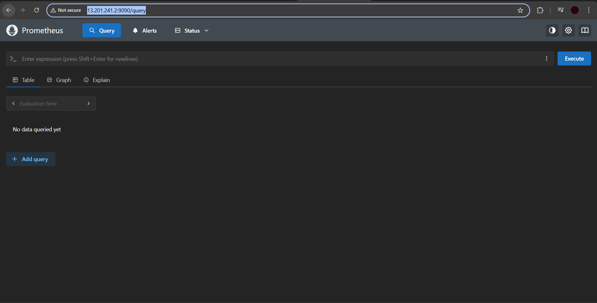
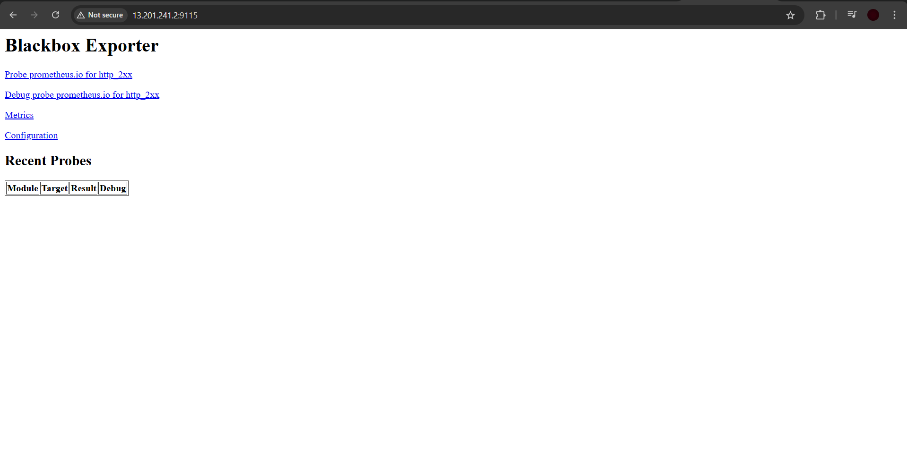
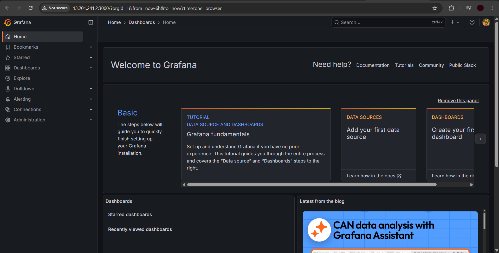

# 🚀 Ultimate DevOps CI/CD Pipeline Project

[](https://aws.amazon.com/)
[](https://kubernetes.io/)
[](https://www.docker.com/)
[](https://www.jenkins.io/)
[](https://www.sonarqube.org/)
[](https://www.sonatype.com/)
[](https://aquasec.github.io/trivy/)
[](https://prometheus.io/)
[](https://grafana.com/)

A production-ready, end-to-end **Enterprise DevOps CI/CD Pipeline** implementation. This repository contains the complete phase-by-phase architecture, configuration guides, automated scripts, and Jenkins pipeline code to build, test, scan, package, deploy, and monitor modern microservice applications on Kubernetes.

---

## 📌 Table of Contents

- [Architecture Overview](#-architecture-overview)
- [Tech Stack & Tools](#-tech-stack--tools)
- [Pipeline Workflow](#-pipeline-workflow)
- [Repository Structure](#-repository-structure)
- [Phase-Wise Setup Guide](#-phase-wise-setup-guide)
  - [Phase 1: Infrastructure & Core Tools Setup](#phase-1-infrastructure--core-tools-setup)
  - [Phase 2: Source Code & Git Version Control](#phase-2-source-code--git-version-control)
  - [Phase 3: Automated CI/CD Jenkins Pipeline](#phase-3-automated-cicd-jenkins-pipeline)
  - [Phase 4: Monitoring & Observability](#phase-4-monitoring--observability)
- [Prerequisites](#-prerequisites)
- [Verification & Testing](#-verification--testing)
- [Pipeline Execution Screenshots & Verification](#-pipeline-execution-screenshots--verification)
- [License](#-license)

---

## 🏗️ Architecture Overview

```
                                  +---------------------------------------------------+
                                  |                 AWS Cloud (EC2)                   |
                                  +---------------------------------------------------+
                                                            |
  +---------------+        +--------------------------------+--------------------------------+
  |  Developer    |        |                                |                                |
  | Push to Git   |        v                                v                                v
  +-------+-------+  +-----------+                  +---------------+                +---------------+
          |          |  Jenkins  |                  |   SonarQube   |                |  Nexus Repo   |
          v          | (CI/CD)   |                  | Code Quality  |                |  Artifacts    |
  +---------------+  +-----+-----+                  +---------------+                +---------------+
  | Git Repo      |        |
  | (Source Code) |        | 1. Git Checkout & Compile (Maven)
  +-------+-------+        | 2. Unit Testing & Trivy FS Scan
          |                | 3. SonarQube Static Analysis & Quality Gate
          +--------------->| 4. Package JAR/WAR & Deploy to Nexus
                           | 5. Build Docker Image & Trivy Image Scan
                           | 6. Push Docker Image to Docker Hub
                           v
                    +--------------+
                    |  Docker Hub  |
                    +-------+------+
                            |
                            v
             +------------------------------+
             |   Kubernetes Cluster (k8s)   |
             |   - Calico Network CNI       |
             |   - NGINX Ingress Controller |
             |   - App Pods (webapps ns)    |
             +--------------+---------------+
                            |
                            v
             +------------------------------+
             |  Monitoring & Observability  |
             |  - Prometheus & Node Exporter|
             |  - Blackbox Exporter         |
             |  - Grafana Dashboards        |
             +------------------------------+
```

---

## 🛠️ Tech Stack & Tools

| Category | Tools & Technologies | Description |
| :--- | :--- | :--- |
| **Cloud Provider** | AWS EC2 (Ubuntu Server 20.04 LTS) | Infrastructure virtual server hosting |
| **Containerization** | Docker, Docker Engine | Container runtime and container image management |
| **Orchestration** | Kubernetes (`kubeadm` v1.28.1) | Container orchestration cluster with Calico CNI & NGINX Ingress |
| **Build Tool** | Apache Maven, JDK 17 (Temurin) | Java compilation, dependency management, and packaging |
| **Continuous Integration** | Jenkins | Automation server orchestrating the end-to-end pipeline |
| **Code Quality** | SonarQube LTS Community | Static code analysis, vulnerability checking, and Quality Gate |
| **Security Scanning** | Aqua Trivy | Filesystem security scan & Docker container image vulnerability scan |
| **Artifact Repository** | Sonatype Nexus 3 | Binary repository manager for build artifacts (`.jar`/`.war`) |
| **Container Registry** | Docker Hub | Public/Private repository for versioned Docker container images |
| **Monitoring** | Prometheus, Node Exporter, Blackbox Exporter | Time-series metrics collection, node performance, and endpoint probing |
| **Visualization** | Grafana | Operational dashboards and visual alerting system |
| **Notifications** | Jenkins Email Extension (`emailext`) | Automated HTML email status reports with attached scan reports |

---

## 🔄 Pipeline Workflow

The Jenkins Pipeline (`Jenkinsfile`) automates 13 distinct stages:

```
[Git Checkout] ➔ [Compile] ➔ [Test] ➔ [File System Scan (Trivy)] ➔ [SonarQube Analysis]
       │
       ▼
[Quality Gate Check] ➔ [Build Package] ➔ [Publish to Nexus] ➔ [Build Docker Image]
       │
       ▼
[Docker Image Scan (Trivy)] ➔ [Push to Docker Hub] ➔ [Deploy to K8s] ➔ [Verify Deployment]
       │
       ▼
[Post-Build Email Notification with Trivy Report Attached]
```

### Stage Summary

1. **Git Checkout**: Fetches the application source code from the Git repository.
2. **Compile**: Executes `mvn compile` to verify Java code syntax and compile source files.
3. **Test**: Executes `mvn test` to run unit test suites.
4. **File System Scan**: Runs `trivy fs` to generate an HTML audit report of project dependencies and codebase vulnerabilities.
5. **SonarQube Analysis**: Triggers `sonar-scanner` to upload code metrics to the SonarQube server.
6. **Quality Gate**: Pauses pipeline execution until SonarQube quality criteria (bugs, vulnerabilities, code smells) are satisfied.
7. **Build**: Packages the tested application into an artifact via `mvn package`.
8. **Publish to Nexus**: Deploys the packaged binary artifact to Nexus Repository Manager via `mvn deploy`.
9. **Build & Tag Docker Image**: Builds container image tagged as `adijaiswal/boardshack:latest`.
10. **Docker Image Scan**: Performs a vulnerability scan on the built Docker image using `trivy image`.
11. **Push Docker Image**: Authenticates with Docker Hub registry and uploads the scanned image.
12. **Deploy to Kubernetes**: Applies Kubernetes manifests (`deployment-service.yaml`) into the target `webapps` namespace.
13. **Verify Deployment**: Queries live Kubernetes Pods (`kubectl get pods -n webapps`) and Services (`kubectl get svc -n webapps`).
14. **Notification**: Dispatches an HTML email report with build status indicators (Green/Red) and attaches Trivy scan reports.

---

## 📁 Repository Structure

```directory
.
├── Boardgame/                    # Spring Boot Java Application Source Code
│   ├── .github/workflows/        # CI workflow definitions
│   ├── src/                      # Java application source code, controllers & templates
│   ├── Dockerfile                # Multi-stage Docker containerization build
│   ├── Jenkinsfile               # Declarative Jenkins CI/CD pipeline script
│   ├── deployment-service.yaml   # Kubernetes Deployment & Service manifests
│   └── pom.xml                   # Maven dependencies and build definitions
├── PHASE-1/                      # Infrastructure & Core Services Setup
│   ├── 1. Create_VM.md           # AWS EC2 Instance Creation Guide (Ubuntu)
│   ├── 2. K8-Setup.md            # Kubernetes 1.28.1 Cluster Setup (kubeadm, Calico, Ingress)
│   ├── Jenkins.md                # Automated Shell Installation Scripts for Jenkins & Docker
│   ├── Nexus.md                  # Nexus 3 Docker Container Setup & Admin Password Retrieval
│   └── Sonarqube.md              # SonarQube LTS Community Docker Setup
├── PHASE-2/                      # Source Code & Repository Management
│   └── Git-Repo-Setup.md         # Git Private Repository, Personal Access Token (PAT) Setup
├── PHASE-3/                      # Continuous Integration & Delivery Pipeline
│   └── CICD.md                   # Required Jenkins Plugins & Declarative Jenkinsfile Pipeline Code
├── PHASE-4/                      # Observability & System Health
│   └── Monitor.md                # Download Links & Installation Guides for Prometheus & Grafana
└── screenshots/                  # Live Pipeline Execution & Monitoring Screenshots
    ├── pipeline overview of all stages.png
    ├── jenkins pipeline done photo.png
    ├── sonar qube error photo.png
    ├── Nexus photo.png
    ├── Prometheus.png
    ├── prometheus adding what to monitor.png
    ├── Black_box_exporter.png
    ├── Grafana.png
    └── Monitoring using grafana blackbox and prometheus.png
```

---

## 📖 Phase-Wise Setup Guide

### Phase 1: Infrastructure & Core Tools Setup

Set up the foundation hosting environment and core DevOps utility tools:

1. **AWS EC2 Provisioning**:
   - Create an Ubuntu Server 20.04 LTS instance on AWS EC2.
   - Configure Security Groups opening ports `22` (SSH), `8080` (Jenkins), `8081` (Nexus), `9000` (SonarQube), `3000` (Grafana), `9090` (Prometheus), `6443` (K8s API), and `80/443` (HTTP/HTTPS).
   - Refer to [`PHASE-1/1. Create_VM.md`](PHASE-1/1.%20Create_VM.md).

2. **Kubernetes Cluster Setup (v1.28.1)**:
   - Install Docker runtime, `kubeadm`, `kubelet`, and `kubectl` on Master & Worker nodes.
   - Initialize Master Node (`kubeadm init --pod-network-cidr=10.244.0.0/16`).
   - Deploy **Calico CNI** for pod networking and **NGINX Ingress Controller** for routing.
   - Refer to [`PHASE-1/2. K8-Setup.md`](PHASE-1/2.%20K8-Setup.md).

3. **CI/CD Tools Deployment**:
   - **Jenkins**: Install OpenJDK 17 and Jenkins service using [`PHASE-1/Jenkins.md`](PHASE-1/Jenkins.md).
   - **Nexus Repository Manager**: Run Nexus container on port `8081` using [`PHASE-1/Nexus.md`](PHASE-1/Nexus.md).
   - **SonarQube**: Launch SonarQube LTS Community container on port `9000` using [`PHASE-1/Sonarqube.md`](PHASE-1/Sonarqube.md).

---

### Phase 2: Source Code & Git Version Control

Set up secure source code management:

1. Create a private repository on GitHub / GitLab.
2. Generate a Personal Access Token (PAT) with `repo` scope.
3. Authenticate local workspace and push code:
   ```bash
   git init
   git add .
   git commit -m "Initial commit - DevOps Pipeline Codebase"
   git branch -M main
   git remote add origin <repository_url>
   git push -u origin main
   ```
4. Full instructions available in [`PHASE-2/Git-Repo-Setup.md`](PHASE-2/Git-Repo-Setup.md).

---

### Phase 3: Automated CI/CD Jenkins Pipeline

Configure Jenkins plugins and execute the Declarative Pipeline:

1. **Install Required Jenkins Plugins**:
   - `Eclipse Temurin Installer` (Java 17 runtime)
   - `Pipeline Maven Integration` (Maven pipeline steps)
   - `Config File Provider` (Centralized `settings.xml`)
   - `SonarQube Scanner` (SonarQube integration)
   - `Kubernetes` & `Kubernetes CLI` (K8s pod execution & `kubectl` step)
   - `Docker` & `Docker Pipeline` (Docker build & registry integration)

2. **Configure Credentials in Jenkins**:
   - `git-cred`: Git Credentials / Personal Access Token
   - `sonar-token`: SonarQube authentication token
   - `docker-cred`: Docker Hub login credentials
   - `k8-cred`: Kubernetes kubeconfig file for target cluster access

3. **Jenkinsfile Declarative Pipeline**:
   The full pipeline definition is available in [`PHASE-3/CICD.md`](PHASE-3/CICD.md).

---

### Phase 4: Monitoring & Observability

Maintain visibility into cluster health and service availability:

1. **Prometheus**: Collects time-series metrics from nodes, pods, and exporter targets (port `9090`).
2. **Node Exporter**: Exposes hardware and OS metrics (CPU, Memory, Disk, Network) from host machines.
3. **Blackbox Exporter**: Performs HTTP/HTTPS, TCP, and ICMP probing of deployed web applications.
4. **Grafana**: Connects to Prometheus as a data source to display interactive dashboards (port `3000`).
5. Reference guide and links available in [`PHASE-4/Monitor.md`](PHASE-4/Monitor.md).

---

## ⚡ Prerequisites

Before launching the pipeline, ensure you have:

- An active **AWS Account** (or equivalent cloud platform).
- Minimum hardware requirement for servers:
  - **Jenkins / Build Server**: 2 vCPUs, 4 GB RAM, 20 GB Disk.
  - **SonarQube & Nexus Server**: 2 vCPUs, 4 GB RAM, 20 GB Disk.
  - **Kubernetes Master Node**: 2 vCPUs, 2 GB RAM.
  - **Kubernetes Worker Node**: 2 vCPUs, 2 GB RAM.
- Installed CLI tools on local management workstation: `git`, `kubectl`, `docker`.
- Docker Hub account for pushing container images.

---

## 🔍 Verification & Testing

To verify the successful execution of the pipeline:

1. **SonarQube Quality Check**: Navigate to `http://<SONARQUBE_IP>:9000` to verify code quality ratings and coverage.
2. **Nexus Artifact Verification**: Access `http://<NEXUS_IP>:8081` and inspect the `maven-releases` / `maven-snapshots` repository.
3. **Docker Hub Image**: Log in to Docker Hub and confirm new tag `adijaiswal/boardshack:latest` exists.
4. **Kubernetes Deployment**:
   ```bash
   kubectl get pods -n webapps
   kubectl get svc -n webapps
   ```
5. **Grafana Dashboard**: Open `http://<GRAFANA_IP>:3000` and view metrics graphs for system resources.

---

## 📸 Pipeline Execution Screenshots & Verification

Below are real-world execution screenshots demonstrating the automated CI/CD pipeline, security scans, artifact storage, and observability stack in operation:

### 1. Jenkins End-to-End Pipeline Stages Overview
Complete visualization of all 14 stages executing successfully in sequence (Tool Install, Git Checkout, Compile, Test, File System Scan, SonarQube Analysis, Quality Gate, Build, Publish to Nexus, Build Docker Image, Docker Image Scan, Push Docker Image, Deploy to Kubernetes, and Post Actions):


---

### 2. Jenkins Build Completion & Automated Email Notification
Console log output verifying successful build completion (`Finished: SUCCESS`) and automated HTML status email dispatch with Trivy security audit report attached:


---

### 3. SonarQube Code Quality & Security Analysis
SonarQube dashboard showing static code analysis, vulnerability scan metrics, code duplication checks, and Quality Gate evaluation:


---

### 4. Sonatype Nexus Artifact Repository Manager
Sonatype Nexus 3 repository dashboard hosting built binary artifacts across `maven-releases` and `maven-snapshots`:


---

### 5. Prometheus Scrape Targets Health Status
Prometheus target health interface confirming that both the `blackbox` HTTP probing exporter and internal `prometheus` metric endpoints are healthy (`UP`):


---

### 6. Prometheus Expression Browser
Prometheus Web UI for ad-hoc querying, time-series analysis, and evaluating metrics scraped from cluster nodes:



---

### 7. Blackbox Exporter Probing Interface
Blackbox Exporter web console probing application endpoints and HTTP health checks across deployed services:



---

### 8. Grafana Observability Dashboard
Grafana monitoring portal connected to Prometheus as the primary data source for visual telemetry:



---

### 9. Grafana & Blackbox HTTP Monitoring Dashboard
Live Grafana dashboard displaying Blackbox Exporter HTTP probing results, endpoint uptime status (`UP` / `DOWN`), SSL certificate expiry, and latency duration graphs:


---

